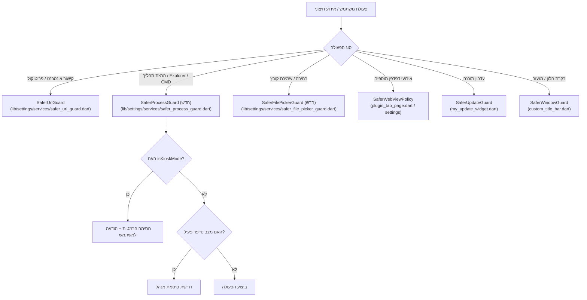

# תוכנית פעולה וארכיטקטורת אבטחה: הידוק "מצב סייפר" ומניעת בריחה מקיוסק (Kiosk Breakout) באוצריא
> **מסמך הנחיה וארכיטקטורה לסוכן המבצע (Implementation Agent Guide)**  
> **גרסה נבדקת:** `dev`  
> **נתיב קובץ:** `docs/SAFER_MODE_ACTION_PLAN.md`  
> **עדכון אחרון:** ספטמבר 2026

---

## 📌 1. תמונת מצב עדכנית (איפה אנחנו עומדים)

כלל שלבי התוכנית (סבב ראשון ושני) **הושלמו והוטמעו במלואם בקוד**, לרבות בדיקות יחידה ייעודיות:

### א. מה בוצע והוטמע בקוד בסבב ראשון (תשתיות ו-`launchUrl`):
1. **חסימת `launchUrl` גלובלית:**
   - הוקם שירות [`SaferUrlGuard`](../lib/settings/services/safer_url_guard.dart).
   - הוחלף `launchUrl` / `launchUrlString` ב-23 קבצים שונים בכל רחבי המערכת (PDF, HTML, דיווח שגיאות, מקור ספר, הערות, תוספים, יומן, אוצר החכמה).
   - במצב קיוסק מנוהל (`isKioskMode`) כתובות מסוכנות נחסמות מיידית; במצב סייפר רגיל נדרש אימות סיסמה.
2. **חסימת קישורי עומק להתקנת תוספים (`otzaria://`):**
   - הוטמעה בדיקת `verifySaferModePassword` עבור `InstallPluginAction` ו-`InstallLocalPluginAction` ב-[`main_window_screen.dart`](../lib/navigation/view/main_window_screen.dart).
3. **תשתית דגל הפעלה לקיוסק:**
   - הוגדר המשתנה הגלובלי `isKioskMode` ב-[`safer_mode_guard.dart`](../lib/settings/services/safer_mode_guard.dart).
   - [`main.dart`](../lib/main.dart) מאתחל את הדגל מתוך ארגומנטי שורת הפקודה (`--kiosk` / `--safer`).
4. **בדיקות אוטומטיות ראשוניות:**
   - נכתבו טסטים עבור `SaferUrlGuard` ב-[`safer_url_guard_test.dart`](../test/settings/services/safer_url_guard_test.dart) ועבור `SettingsBloc` / `SaferModeGuard`.

### ב. מה בוצע והוטמע בקוד בסבב שני (תיקון כל 8 וקטורי הבריחה):
1. **מניעת הרצת סייר הקבצים (`explorer.exe`) והרצת תהליכים:**
   - הוקם שירות מרכזי [`SaferProcessGuard`](../lib/settings/services/safer_process_guard.dart) עם מתודות `openInFileManager` ו-`openErrorLog`.
   - במצב קיוסק: פתיחת סייר קבצים חסומה הרמטית (אף עם סיסמה).
   - במצב סייפר רגיל: דורש אימות סיסמה מקדימה.
   - עבור לוג שגיאות: במצב קיוסק וסייפר מוצג דיאלוג פנימי עם הטקסט וכפתור העתקה ללוח במקום שיגור `explorer.exe`.
   - הוחלף בכל 6 המוקדים במערכת ([`custom_folders_panel.dart`](../lib/settings/panels/custom_folders_panel.dart), [`library_settings_tab.dart`](../lib/settings/tabs/library_settings_tab.dart), [`system_settings_tab.dart`](../lib/settings/tabs/system_settings_tab.dart), [`backup_service.dart`](../lib/settings/services/backup_service.dart), [`main_window_screen.dart`](../lib/navigation/view/main_window_screen.dart)).
2. **חסימת הפעלת אוצר החכמה המקומית ו-`cmd.exe`:**
   - ב-[`otzar_book_dialog.dart`](../lib/library/view/otzar_book_dialog.dart): כפתור "פתח מקומית" נחסם לחלוטין בקיוסק ודורש סיסמה בסייפר.
3. **חסימת בוררי קבצים (`FilePicker`):**
   - ב-[`calendar_settings_panel.dart`](../lib/settings/panels/calendar_settings_panel.dart): ייבוא ICS נחסם בקיוסק ודורש סיסמה בסייפר.
   - ב-[`app_report_image_sources.dart`](../lib/app_report/services/app_report_image_sources.dart): בחירת תמונות לדיווח נחסמת בקיוסק ודורשת סיסמה בסייפר.
   - ב-[`save_file_with_extension.dart`](../lib/utils/file/save_file_with_extension.dart): שמירת קובץ דרך הדיאלוג של Windows נחסמת לחלוטין בקיוסק (מחזירה `null`).
4. **הקשחת מנוע התוספים (WebView2 / Edge):**
   - ב-[`plugin_tab_page.dart`](../lib/plugins/view/plugin_tab_page.dart) וב-[`plugin_background_host.dart`](../lib/plugins/view/plugin_background_host.dart): נוטרל תפריט קליק ימני (`disableContextMenu: true` בקיוסק/סייפר), נוטרל DevTools (`isInspectable: false` בקיוסק), ונחסמו חלונות קופצים (`onCreateWindow: async => false`).
   - ב-[`plugin_download_handler.dart`](../lib/plugins/services/plugin_download_handler.dart): הורדות קבצים מבוטלות אוטומטית במצב קיוסק.
   - ב-[`plugin_bridge_adapter.dart`](../lib/plugins/bridge/plugin_bridge_adapter.dart): יצירת קיצור דרך (`shortcut.create`) נחסמת בקיוסק ודורשת סיסמה בסייפר.
5. **נעילת מנגנון העדכון האוטומטי:**
   - ב-[`my_update_widget.dart`](../lib/update/my_update_widget.dart): במצב קיוסק מושבתת לחלוטין בדיקת עדכונים, הורדתם והפעלת מתקינים (`isKiosk: isKioskMode`). הרצת מתקין ישירה דורשת אימות סיסמה.
6. **בקרת חלון ומזעור:**
   - ב-[`custom_title_bar.dart`](../lib/navigation/view/custom_title_bar.dart): הוסר כפתור המזעור במצב קיוסק (גם במסך מלא וגם בחלון רגיל).
7. **חבילת בדיקות יחידה (Unit Tests):**
   - נוספו והורחבו קבצי בדיקות ב-[`test/settings/services/safer_process_guard_test.dart`](../test/settings/services/safer_process_guard_test.dart), [`test/plugins/services/plugin_download_handler_test.dart`](../test/plugins/services/plugin_download_handler_test.dart), [`test/update/my_update_widget_test.dart`](../test/update/my_update_widget_test.dart), ו-[`test/utils/file/save_file_with_extension_test.dart`](../test/utils/file/save_file_with_extension_test.dart).

---

## ⚠️ 2. ניתוח כשלי דו"ח סוכן המחקר (The Blind Spots)

דו"ח סוכן המחקר הראשוני התמקד כמעט אך ורק ב-`launchUrl` ובקישורי אינטרנט, וקבע בטעות כי סייר הקבצים (`explorer.exe`) ובוררי הקבצים (`FilePicker`) "מאובטחים כראוי".
בדיקת עומק מקיפה שבוצעה בקוד גילתה **עיוורון חמור והנחות שגויות**:

1. **הנחת שווא לגבי סייר הקבצים:**
   הסוכן ראה שפתיחת יומן שגיאות ב-`main_window_screen.dart` דורשת סיסמה, והניח שזה מספיק. בפועל:
   - בעמדת קיוסק ציבורית, **פתיחת `explorer.exe` (גם לאחר הקשת סיסמת מנהל) שוברת לחלוטין את הנעילה** ומעניקה למשתמש חלון Explorer פעיל עם שורת כתובת, CMD, גישה לכל הכוננים והרצת יישומים.
   - קיימות **6 נקודות שונות** בקוד שמריצות `Process.run('explorer', ...)` ישירות — חלקן ללא שום בדיקת סיסמה!
2. **הנחת שווא לגבי `FilePicker`:**
   הסוכן הניח שכל בוררי הקבצים חסומים דרך `saveFileWithExtension`. בפועל:
   - בלוח השנה (`CalendarSettingsPanel`) קיים כפתור "ייבא קובץ ICS" הפותח `FilePicker.pickFile` לכל משתמש ללא שום אימות.
   - בדיאלוג דיווח תקלות (`app_report`) קיים כפתור "הוסף תמונה" הפותח `FilePicker.pickFiles` לכל קורא ללא אימות.
   - ב-Windows, דיאלוג בחירת קובץ של המערכת הוא חלון סייר קבצים לכל דבר המאפשר קליק ימני, "פתח באמצעות...", הרצת CMD וניווט במערכת.
3. **התעלמות מוחלטת ממנוע התוספים (WebView2 / Edge):**
   הסוכן לא בדק את הגדרות ה-WebView:
   - תפריט קליק ימני (Context Menu) של Edge אינו מנוטרל! לחיצה ימנית בכל תוסף מאפשרת פתיחת DevTools, שמירת דף, הדפסה דרך הדיאלוג של Edge ופתיחת חלונות חיצוניים.
   - הורדת קבצים (`onDownloadStarting`) אינה חסומה.
4. **עקיפת Job Object בעדכונים (`CREATE_BREAKAWAY_FROM_JOB`):**
   מנגנון העדכון האוטומטי משגר מתקין חיצוני באמצעות קריאת Win32 `CreateProcess` עם דגל המנתק את התהליך במפורש מה-Job Object שבו מריצה מערכת הקיוסק (כמו "סייפר") את אוצריא!
5. **מזעור חלון (Window Minimize):**
   כפתור המזעור ב-`custom_title_bar.dart` ממזער את אוצריא וחושף מיידית את שולחן העבודה של Windows שמאחוריה.

---

## 🔍 3. מיפוי מלא של וקטורי הבריחה שנחשפו (Breakout Vectors)

### וקטור 1: הרצת סייר הקבצים ומנהלי קבצים (`Process.run('explorer', ...)`)
* **מוקדים בקוד:**
  1. [`lib/settings/panels/custom_folders_panel.dart:233`](../lib/settings/panels/custom_folders_panel.dart#L233) (`_openInFileManager`) — הרצה ישירה ללא בדיקת סיסמה.
  2. [`lib/settings/tabs/library_settings_tab.dart:257, 423`](../lib/settings/tabs/library_settings_tab.dart#L257) (`_openInFileManager`) — הרצה ישירה בלחיצה על סמל התיקייה.
  3. [`lib/settings/tabs/system_settings_tab.dart:2159`](../lib/settings/tabs/system_settings_tab.dart#L2159) — פעולת סרגל הודעות "פתח מיקום קובץ" בסיום גיבוי מריצה Explorer ללא אימות.
  4. [`lib/settings/tabs/system_settings_tab.dart:2749`](../lib/settings/tabs/system_settings_tab.dart#L2749) — לחיצה על פתיחת תיקיית גיבוי מריצה Explorer ללא אימות.
  5. [`lib/settings/services/backup_service.dart:79`](../lib/settings/services/backup_service.dart#L79) (`openBackupDirectory`) — קריאה ישירה ל-`Process.run('explorer')`.
  6. [`lib/navigation/view/main_window_screen.dart:3709`](../lib/navigation/view/main_window_screen.dart#L3709) (`_openErrorLogFile`) — מציג אמנם אימות סיסמה, אך לאחריו מפעיל `explorer.exe`. בעמדת קיוסק חל איסור לפתוח Explorer גם עם סיסמה (יש להציג את הלוג בתוך דיאלוג פנימי).

### וקטור 2: שיגור מתקין עצמאי מחוץ ל-Job Object (`windows_installer_io.dart`)
* **מוקדים בקוד:**
  - [`lib/update/windows_installer_io.dart:40-43, 62`](../lib/update/windows_installer_io.dart#L40) — שימוש ב-`CreateProcessW` עם `CREATE_BREAKAWAY_FROM_JOB | CREATE_NEW_PROCESS_GROUP | DETACHED_PROCESS`.
  - [`lib/update/my_update_widget.dart:1046, 1090`](../lib/update/my_update_widget.dart#L1046) — הפעלת המתקין ללא שום בדיקת `isKioskMode` או סיסמת סייפר.
* **הסכנה:** משתמש שלוחץ על באנר/דיאלוג עדכון משגר קובץ הרצה חיצוני עם הרשאות מלאות ו-GUI מחוץ למגבלות הקיוסק.

### וקטור 3: הפעלת תוכנת אוצר החכמה המקומית ו-`cmd.exe` (`otzar_utils.dart`)
* **מוקדים בקוד:**
  - [`lib/utils/navigation/otzar_utils.dart:161, 169, 188`](../lib/utils/navigation/otzar_utils.dart#L161) — מריץ `Process.run(exePath, ...)` ואם נכשל מריץ `Process.run('cmd', ['/c', 'start', ...])`.
  - [`lib/library/view/otzar_book_dialog.dart:168-175`](../lib/library/view/otzar_book_dialog.dart#L168) — כפתור "פתח מקומית" מופעל ישירות ללא שום בדיקת סיסמה.
* **הסכנה:** הרצת יישום שולחני חיצוני מלא (אוצר החכמה) שיש בו תפריטים, הדפסות ושמירת קבצים, או פתיחת `cmd.exe`.

### וקטור 4: פרצות `FilePicker` הפתוחות למשתמש רגיל
* **מוקדים בקוד:**
  - [`lib/settings/panels/calendar_settings_panel.dart:651`](../lib/settings/panels/calendar_settings_panel.dart#L651) (`_importIcsFile`) — נגיש לכל משתמש דרך מסך לוח השנה (סמל גלגל שיניים) -> "ייבא קובץ ICS". פותח `FilePicker.pickFile` ללא אימות כלל.
  - [`lib/app_report/services/app_report_image_sources.dart:71`](../lib/app_report/services/app_report_image_sources.dart#L71) (`pickFiles`) — בדיאלוג דיווח תקלה, לחיצה על "הוסף תמונה" פותחת `FilePicker.pickFiles` ללא שום אימות.
  - [`lib/utils/file/save_file_with_extension.dart:29`](../lib/utils/file/save_file_with_extension.dart#L29) — במצב `isKioskMode` מאפשר כיום פתיחת דיאלוג שמירה אם הוזנה סיסמה. בקיוסק יש לחסום שמירה לדיאלוג מערכת לחלוטין.

### וקטור 5: מנוע WebView2 בתוספים (`plugin_tab_page.dart`)
* **מוקדים בקוד:**
  - [`lib/plugins/view/plugin_tab_page.dart:202`](../lib/plugins/view/plugin_tab_page.dart#L202) (`buildPluginTabWebViewSettings`) — לא מוגדר `disableContextMenu: true`. קליק ימני פותח תפריט Edge מלא (כולל Print, Save as, DevTools).
  - [`lib/plugins/view/plugin_tab_page.dart:872`](../lib/plugins/view/plugin_tab_page.dart#L872) — אין מימוש של `onCreateWindow`. קריאות `window.open` בדפי תוסף עלולות להקפיץ חלונות דפדפן חדשים.
  - [`lib/plugins/services/plugin_download_handler.dart:13-28`](../lib/plugins/services/plugin_download_handler.dart#L13) — הורדות קבצים מאושרות ונשמרות בדיסק המשתמש.

### וקטור 6: יצירת קיצורי דרך בשולחן העבודה (`PluginShortcutService`)
* **מוקדים בקוד:**
  - [`lib/plugins/bridge/plugin_bridge_adapter.dart:4460-4475`](../lib/plugins/bridge/plugin_bridge_adapter.dart#L4460) — יצירת קיצור דרך בשולחן העבודה או תפריט התחל מציגה דיאלוג אישור רגיל בלבד ואינה דורשת סיסמת סייפר, ומותרת כרגע גם בקיוסק.

### וקטור 7: בקרי חלון ומזעור (`custom_title_bar.dart`)
* **מוקדים בקוד:**
  - [`lib/navigation/view/custom_title_bar.dart:340`](../lib/navigation/view/custom_title_bar.dart#L340) — כפתור מזעור מריץ `window.minimize()` וממזער את אוצריא אל שולחן העבודה.
  - [`lib/navigation/view/custom_title_bar.dart:355-363`](../lib/navigation/view/custom_title_bar.dart#L355) — כשלא במסך מלא מוצגים כפתורי ה-Caption הרגילים של חלון Windows.

---

## 🏛️ 4. ארכיטקטורת האבטחה המוצעת (Target Security Architecture)

העיקרון המנחה: **Zero-Trust Kiosk Architecture**. במצב קיוסק מנוהל (`isKioskMode`), שום אינטראקציה לא תוביל להרצת תהליך חיצוני, פתיחת סייר קבצים או חשיפת שולחן העבודה, גם אם מנסים לאמת סיסמה. במצב סייפר רגיל (`protectedModeEnabled`), כל פעולה מסוכנת נאכפת דרך שער מרכזי (Guard).

### מרכיבי הארכיטקטורה:

1. **`SaferProcessGuard` (שירות מרכזי חדש):**
   - קובץ: `lib/settings/services/safer_process_guard.dart`.
   - פונקציות:
     - `Future<bool> safeOpenInFileManager(BuildContext? context, String path)`:
       - ב-`isKioskMode`: חוסם תמיד! מחזיר `false` ומציג `UiSnack.show('פתיחת סייר הקבצים חסומה בעמדה זו')`.
       - במצב סייפר רגיל: דורש `verifySaferModePassword`.
     - `Future<bool> safeLaunchProcess(...)`:
       - מונע הרצת `cmd`, `powershell`, או קבצי הרצה זרים.
     - הצגת יומן שגיאות (`ErrorLogFile`):
       - במקום לפתוח ב-Explorer, מציג דיאלוג פנימי מעוצב (`showDialog`) עם תוכן הטקסט של השגיאות וכפתור "העתק ללוח".
2. **`SaferFilePickerGuard` (הידוק בוררי קבצים):**
   - קובץ: `lib/settings/services/safer_file_picker_guard.dart`.
   - כל קריאה ל-`FilePicker` במערכת תעבור דרכו או תהיה מוגנת:
     - בלוח השנה (`CalendarSettingsPanel`): הוספת אימות סיסמה לפני ייבוא ICS, וחסימה מוחלטת ב-`isKioskMode`.
     - בדיווח תקלות (`app_report_image_sources.dart`): הוספת אימות סיסמה או חסימת בחירת קובץ במצב קיוסק.
     - ב-`saveFileWithExtension.dart`: ב-`isKioskMode`, חסימת שמירה דרך דיאלוג מערכת (מחזיר `null`).
3. **`SaferWebViewPolicy` (הקשחת מנוע התוספים WebView2):**
   - ב-`buildPluginTabWebViewSettings`: הגדרת `disableContextMenu: true` (תמיד במצב קיוסק ובמצב סייפר).
   - הגדרת `isInspectable: false` כברירת מחדל אלא אם הופעל במפורש דגל פיתוח.
   - מימוש `onCreateWindow`: החזרת `false` לחסימת חלונות קופצים.
   - ב-`onDownloadStarting`: ביטול הורדות במצב קיוסק/סייפר (`DownloadStartResponse(handled: true, ...)` או ביטול).
4. **`SaferUpdateGuard` (נעילת מנגנון העדכון):**
   - ב-`lib/update/my_update_widget.dart`:
     - אם `isKioskMode` פעיל: השבתת בדיקת עדכונים והסתרת כפתורי עדכון.
     - במצב סייפר: דרישת סיסמת מנהל לפני הורדה או הרצת מתקין.
5. **`SaferWindowPolicy` (בקרת כפתורי חלון):**
   - ב-`lib/navigation/view/custom_title_bar.dart`:
     - אם `isKioskMode` או `settingsState.isFullscreen`: כפתור "מזער" מוסתר לחלוטין!
     - מניעת יציאה ממסך מלא במצב קיוסק.

---

## 📝 5. תוכנית עבודה וסטטוס ביצוע (Implementation & Verification Status)

כל המשימות להלן **הושלמו במלואן ונבדקו**:

### משימה 1: הקמת `SaferProcessGuard` והחלפת כל קריאות סייר הקבצים
* **סטטוס:** ✅ **הושלם במלואו**
* **קובץ שנוצר:** [`lib/settings/services/safer_process_guard.dart`](../lib/settings/services/safer_process_guard.dart)
  - `openInFileManager`: במצב קיוסק חוסם לחלוטין ומציג הודעת `UiSnack`. במצב סייפר מוודא `verifySaferModePassword`.
  - `openErrorLog`: במקום להריץ `explorer.exe` על קובץ הלוג, מציג דיאלוג בתוך האפליקציה עם תוכן הלוג וכפתור העתקה ללוח (`Clipboard`).
  - כולל `@visibleForTesting processRunnerOverride` המאפשר בדיקות יחידה מבודדות ללא הרצת תהליכים אמיתיים במערכת ההפעלה.
* **הטמעה בכל המוקדים:**
  - [`lib/settings/panels/custom_folders_panel.dart:230`](../lib/settings/panels/custom_folders_panel.dart#L230)
  - [`lib/settings/tabs/library_settings_tab.dart:254`](../lib/settings/tabs/library_settings_tab.dart#L254)
  - [`lib/settings/tabs/system_settings_tab.dart:2152, 2740`](../lib/settings/tabs/system_settings_tab.dart#L2152)
  - [`lib/settings/services/backup_service.dart:76`](../lib/settings/services/backup_service.dart#L76)
  - [`lib/navigation/view/main_window_screen.dart:3704`](../lib/navigation/view/main_window_screen.dart#L3704)
* **בדיקות יחידה:** [`test/settings/services/safer_process_guard_test.dart`](../test/settings/services/safer_process_guard_test.dart)

### משימה 2: חסימת "פתח מקומית" באוצר החכמה ו-`cmd.exe`
* **סטטוס:** ✅ **הושלם במלואו**
* **קבצים:**
  - [`lib/library/view/otzar_book_dialog.dart:168`](../lib/library/view/otzar_book_dialog.dart#L168): כפתור "פתח מקומית" נחסם מיידית עם הודעת טוסט ב-`isKioskMode`, ודורש אימות סיסמה דרך `verifySaferModePassword` במצב סייפר רגיל.

### משימה 3: חסימת פרצות `FilePicker` בלוח השנה ובדיווח התקלות
* **סטטוס:** ✅ **הושלם במלואו**
* **לוח שנה:**
  - [`lib/settings/panels/calendar_settings_panel.dart:649`](../lib/settings/panels/calendar_settings_panel.dart#L649): `_importIcsFile` נחסם בקיוסק ודורש סיסמת מנהל במצב סייפר.
* **דיווח תקלות:**
  - [`lib/app_report/services/app_report_image_sources.dart:70`](../lib/app_report/services/app_report_image_sources.dart#L70): בחירת תמונות מרובות נחסמת בקיוסק ודורשת סיסמת מנהל במצב סייפר.
* **שמירת קבצים:**
  - [`lib/utils/file/save_file_with_extension.dart:21`](../lib/utils/file/save_file_with_extension.dart#L21): שמירה דרך דיאלוג מערכת Windows נחסמת הרמטית בקיוסק (מחזירה `null` עם הודעת טוסט).
* **בדיקות יחידה:** [`test/utils/file/save_file_with_extension_test.dart`](../test/utils/file/save_file_with_extension_test.dart)

### משימה 4: הקשחת מנוע WebView2 בתוספים
* **סטטוס:** ✅ **הושלם במלואו**
* **קבצים:**
  - [`lib/plugins/view/plugin_tab_page.dart:200, 874`](../lib/plugins/view/plugin_tab_page.dart#L200) ו-[`lib/plugins/view/plugin_background_host.dart:58`](../lib/plugins/view/plugin_background_host.dart#L58):
    - `disableContextMenu: true` (מופעל תמיד במצב קיוסק וסייפר).
    - `isInspectable: false` במצב קיוסק (מונע פתיחת DevTools).
    - `onCreateWindow: (controller, createWindowAction) async => false` (מונע חלונות קופצים).
    - `onShowFileChooser`: חסום בקיוסק.
    - `pickFolder`, `pickFile`, `pickSaveLocation`: חסומים בקיוסק.
  - [`lib/plugins/services/plugin_download_handler.dart:18`](../lib/plugins/services/plugin_download_handler.dart#L18):
    - הורדות דרך WebView2 מבוטלות אוטומטית במצב קיוסק (`DownloadStartResponseAction.CANCEL`).
  - [`lib/plugins/bridge/plugin_bridge_adapter.dart:4454`](../lib/plugins/bridge/plugin_bridge_adapter.dart#L4454):
    - יצירת קיצור דרך (`shortcut.create`) נחסמת בקיוסק ודורשת אימות סיסמה בסייפר.
* **בדיקות יחידה:** [`test/plugins/services/plugin_download_handler_test.dart`](../test/plugins/services/plugin_download_handler_test.dart)

### משימה 5: השבתת מנגנון העדכון במצב קיוסק
* **סטטוס:** ✅ **הושלם במלואו**
* **קבצים:**
  - [`lib/update/my_update_widget.dart:215, 1070`](../lib/update/my_update_widget.dart#L215):
    - במצב קיוסק מושבתת בדיקת עדכונים אוטומטית והורדתם (`managesUpdatesInThisWindow(isKiosk: isKioskMode)`).
    - הרצת מתקין ישירה (`_launchInstallerDirect`) נחסמת בקיוסק ודורשת סיסמה בסייפר.
* **בדיקות יחידה:** [`test/update/my_update_widget_test.dart`](../test/update/my_update_widget_test.dart)

### משימה 6: בקרת חלון ומזעור בקיוסק
* **סטטוס:** ✅ **הושלם במלואו**
* **קבצים:**
  - [`lib/navigation/view/custom_title_bar.dart:324, 353`](../lib/navigation/view/custom_title_bar.dart#L324):
    - במסך מלא: כפתור המזעור מנוטרל ומוסתר במצב קיוסק.
    - במצב חלון: במצב קיוסק כפתור ה-Minimize מנוטרל מה-WindowCaption.

---

## 🧪 6. תוכנית אימות ובדיקות (Verification Plan & Suite)

### בדיקות יחידה שהוטמעו (Unit Tests):
1. **`test/settings/services/safer_process_guard_test.dart`**:
   - בדיקת חסימת `openInFileManager` במצב קיוסק (`isKioskMode = true`).
   - בדיקת דרישת סיסמת מנהל במצב סייפר (`protectedModeEnabled = true`).
   - בדיקת ביצוע תקין כשהסיסמה מאומתת וכשמצב סייפר כבוי.
   - בדיקת דיאלוג פנימי עבור לוג שגיאות ללא הרצת Explorer.
2. **`test/settings/services/safer_url_guard_test.dart`**:
   - בדיקת חסימת כתובות URL מסוכנות במצב קיוסק.
   - בדיקת אימות סיסמה במצב סייפר.
   - בדיקת תמיכה ב-white-list / mailto / tel.
3. **`test/plugins/services/plugin_download_handler_test.dart`**:
   - בדיקת ביטול הורדת קבצים ב-WebView2 במצב קיוסק (`isKiosk: true`).
4. **`test/update/my_update_widget_test.dart`**:
   - בדיקת השבתת ניהול עדכונים במצב קיוסק (`managesUpdatesInThisWindow`).
5. **`test/utils/file/save_file_with_extension_test.dart`**:
   - בדיקת חסימת דיאלוג שמירת קובץ במצב קיוסק והחזרת `null`.

